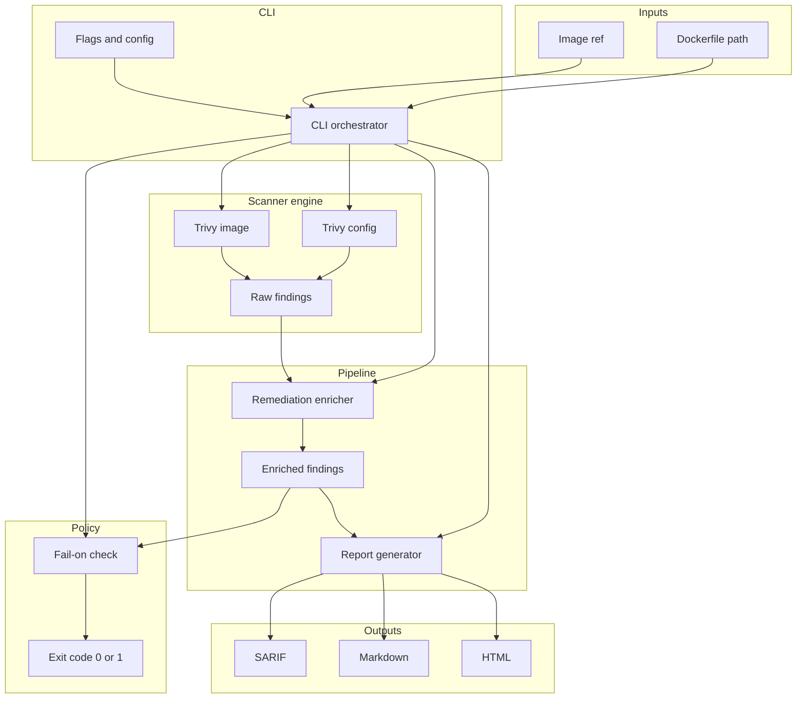
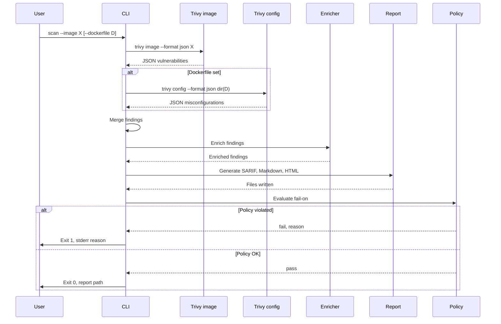
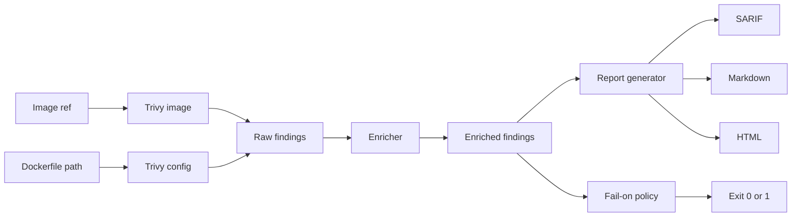
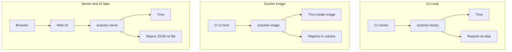

# Architecture and workflow diagrams

Mermaid diagrams for the Docker Container Scanner. Render in any Markdown viewer that supports Mermaid (e.g. GitHub, GitLab, VS Code).

---

## Architecture diagram

High-level components and how they connect.

---

## Scan workflow diagram

End-to-end flow from user command to report and exit code.

---

## Data flow (simplified)

---

## Deployment topologies

---

*See [System design](system-design.md) for detailed components, interfaces, and failure modes.*
