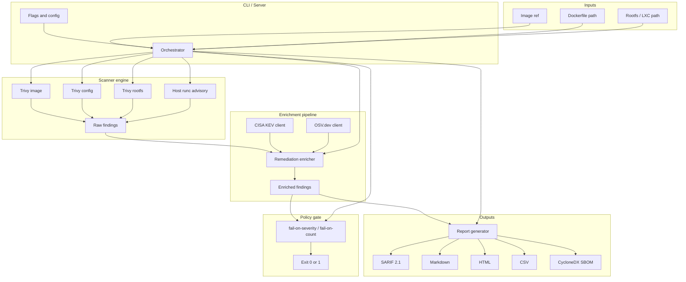
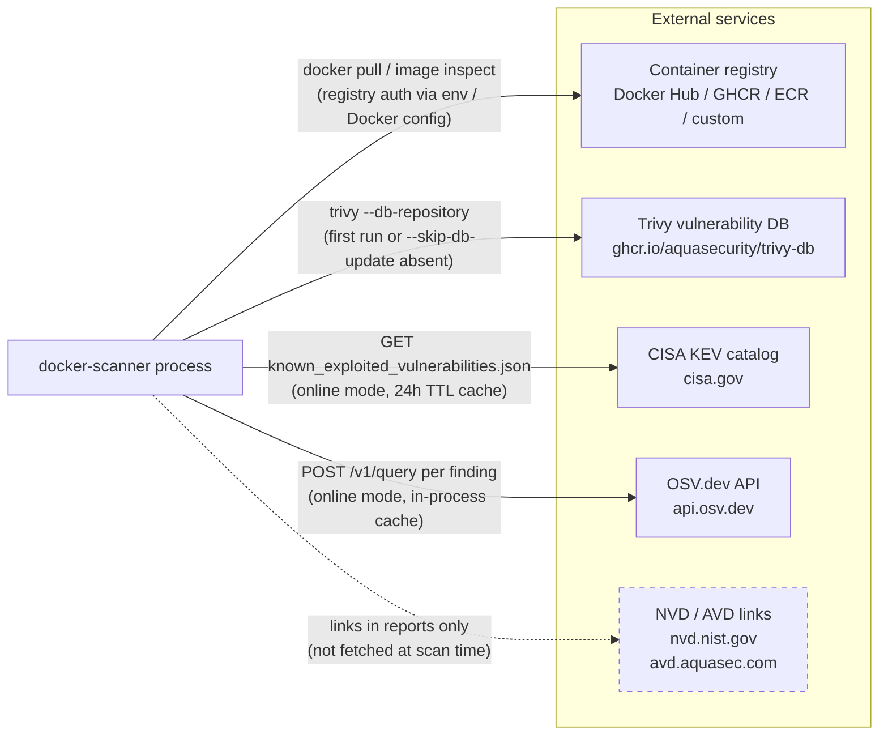
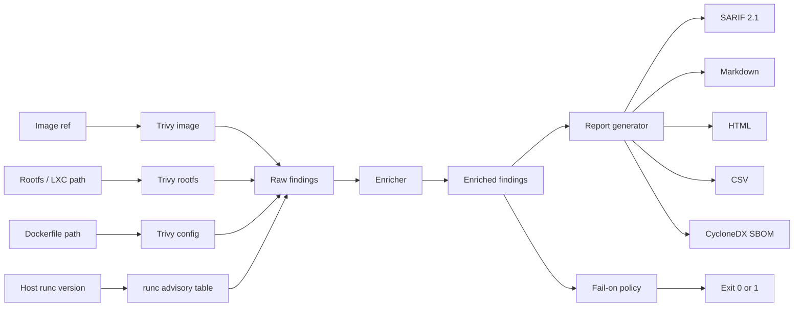
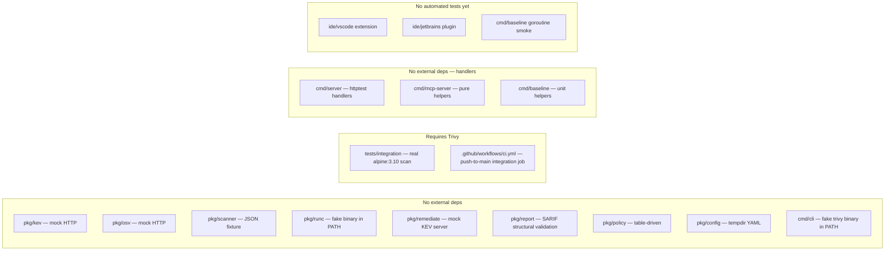

# Architecture and workflow diagrams

Mermaid diagrams for the Docker Container Scanner. Render in any Markdown viewer that supports Mermaid (e.g. GitHub, GitLab, VS Code).

---

## Architecture diagram

High-level components and how they connect.

```mermaid
flowchart TB
  subgraph inputs [Inputs]
    ImageRef[Image ref]
    Dockerfile[Dockerfile path]
    RootfsPath[Rootfs / LXC path]
  end

  subgraph cli [CLI / Server]
    Flags[Flags and config]
    Flags --> CLI_Orchestrator[Orchestrator]
  end

  subgraph engine [Scanner engine]
    TrivyImage[Trivy image]
    TrivyConfig[Trivy config]
    TrivyRootfs[Trivy rootfs]
    TrivyImage --> RawFindings[Raw findings]
    TrivyConfig --> RawFindings
    TrivyRootfs --> RawFindings
    RuncAdvisory[Host runc advisory] --> RawFindings
  end

  subgraph enrichment [Enrichment pipeline]
    KEV[CISA KEV client]
    OSV[OSV.dev client]
    Enricher[Remediation enricher]
    RawFindings --> Enricher
    KEV --> Enricher
    OSV --> Enricher
    Enricher --> EnrichedFindings[Enriched findings]
  end

  subgraph outputs [Outputs]
    ReportGen[Report generator]
    SARIF[SARIF 2.1]
    Markdown[Markdown]
    HTML[HTML]
    CSV[CSV]
    SBOM[CycloneDX SBOM]
    EnrichedFindings --> ReportGen
    ReportGen --> SARIF
    ReportGen --> Markdown
    ReportGen --> HTML
    ReportGen --> CSV
    ReportGen --> SBOM
  end

  subgraph policy [Policy gate]
    FailOn[fail-on-severity / fail-on-count]
    EnrichedFindings --> FailOn
    FailOn --> ExitCode[Exit 0 or 1]
  end

  ImageRef --> CLI_Orchestrator
  Dockerfile --> CLI_Orchestrator
  RootfsPath --> CLI_Orchestrator
  CLI_Orchestrator --> TrivyImage
  CLI_Orchestrator --> TrivyConfig
  CLI_Orchestrator --> TrivyRootfs
  CLI_Orchestrator --> RuncAdvisory
  CLI_Orchestrator --> Enricher
  CLI_Orchestrator --> ReportGen
  CLI_Orchestrator --> FailOn
```

---

## Scan workflow diagram

End-to-end flow from user command to report and exit code.

```mermaid
sequenceDiagram
  participant User
  participant CLI
  participant TrivyImage as Trivy image
  participant TrivyConfig as Trivy config
  participant RuncAdvisory as runc advisory
  participant KEV as CISA KEV
  participant OSV as OSV.dev
  participant Enricher
  participant Report
  participant Policy

  User->>CLI: scan --image X [--dockerfile D] [--check-runtime]
  CLI->>TrivyImage: trivy image --format json --detection-priority comprehensive X
  TrivyImage-->>CLI: JSON vulnerabilities

  alt Dockerfile set
    CLI->>TrivyConfig: trivy config --format json dir(D)
    TrivyConfig-->>CLI: JSON misconfigurations
  end

  alt --check-runtime
    CLI->>RuncAdvisory: docker version / runc --version
    RuncAdvisory-->>CLI: advisory findings for known container escape CVEs
  end

  CLI->>CLI: Merge findings

  CLI->>Enricher: Enrich findings (offline flag)
  alt online mode
    Enricher->>KEV: Load CISA KEV catalog (24h cache)
    KEV-->>Enricher: exploitable CVE list
    Enricher->>OSV: Query OSV.dev for CVE back-fill (per finding)
    OSV-->>Enricher: CVE / GHSA IDs
  end
  Enricher-->>CLI: Enriched findings (Exploitable, WhySeverity, ExploitInfo, severity upgrade)

  CLI->>Report: Generate SARIF 2.1, Markdown, HTML, CSV
  Report-->>CLI: Files written to output-dir

  CLI->>Policy: EvaluateFailPolicy(fail-on-severity, fail-on-count)
  alt Policy violated
    Policy-->>CLI: shouldFail=true, reason
    CLI->>User: stderr reason; exit 1
  else Policy OK
    Policy-->>CLI: shouldFail=false
    CLI->>User: stdout "Scan complete"; exit 0
  end
```

---

## Network diagram

External services the scanner communicates with and when.

```mermaid
flowchart LR
  Scanner[docker-scanner process]

  subgraph external [External services]
    Registry[Container registry\nDocker Hub / GHCR / ECR / custom]
    TrivyDB[Trivy vulnerability DB\nghcr.io/aquasecurity/trivy-db]
    CISA[CISA KEV catalog\ncisa.gov]
    OSVAPI[OSV.dev API\napi.osv.dev]
    NVD[NVD / AVD links\nnvd.nist.gov\navd.aquasec.com]
  end

  Scanner -- "docker pull / image inspect\n(registry auth via env / Docker config)" --> Registry
  Scanner -- "trivy --db-repository\n(first run or --skip-db-update absent)" --> TrivyDB
  Scanner -- "GET known_exploited_vulnerabilities.json\n(online mode, 24h TTL cache)" --> CISA
  Scanner -- "POST /v1/query per finding\n(online mode, in-process cache)" --> OSVAPI
  Scanner -. "links in reports only\n(not fetched at scan time)" .-> NVD

  style NVD stroke-dasharray: 5 5
```

**Offline mode (`--offline`):** Registry pull still happens (image must exist locally); Trivy DB update and OSV queries are skipped; CISA KEV is not fetched. Reports use only Trivy output.

**Air-gapped:** Pre-populate Trivy cache (`trivy image --download-db-only`), run with `--offline --cache-dir /cache`. No outbound calls.

---

## Data flow (simplified)

```mermaid
flowchart LR
  A[Image ref] --> B[Trivy image]
  B2[Rootfs / LXC path] --> B3[Trivy rootfs]
  C[Dockerfile path] --> D[Trivy config]
  E[Host runc version] --> F[runc advisory table]
  B --> G[Raw findings]
  B3 --> G
  D --> G
  F --> G
  G --> H[Enricher]
  H --> I[Enriched findings]
  I --> J[Report generator]
  J --> K[SARIF 2.1]
  J --> L[Markdown]
  J --> M[HTML]
  J --> N[CSV]
  J --> O[CycloneDX SBOM]
  I --> P[Fail-on policy]
  P --> Q[Exit 0 or 1]
```

---

## Deployment topologies

```mermaid
flowchart TB
  subgraph topo1 [CLI-only / CI runner]
    C1[CI step]
    C1 --> S1[scanner binary]
    S1 --> T1[Trivy in PATH]
    S1 --> O1[SARIF + reports]
    O1 --> GH[GitHub Security tab]
  end

  subgraph topo2 [Docker image]
    C2[CI or host]
    C2 --> D2[scanner Docker image]
    D2 --> T2[Trivy bundled]
    D2 --> O2[Reports in volume]
  end

  subgraph topo3 [Server and Web UI]
    C3[Browser]
    C3 --> W3[web/index.html SSE client]
    W3 --> SRV[scanner serve :8080]
    SRV --> T3[Trivy]
    SRV --> O3[JSON findings stream]
  end

  subgraph topo4 [AI assistant via MCP]
    C4[Claude / Cursor / Copilot]
    C4 --> MCP[scanner mcp-server]
    MCP --> T4[Trivy]
    MCP --> O4[JSON findings tool response]
  end

  subgraph topo5 [Air-gapped]
    C5[Offline runner]
    C5 --> S5[scanner --offline]
    S5 --> TC[Trivy cache pre-populated]
    S5 --> O5[Reports from cached DB]
  end
```

---

## Test coverage map

How the test suite maps onto the architecture.

```mermaid
flowchart LR
  subgraph tested_no_deps [No external deps]
    U1[pkg/kev — mock HTTP]
    U2[pkg/osv — mock HTTP]
    U3[pkg/scanner — JSON fixture]
    U4[pkg/runc — fake binary in PATH]
    U5[pkg/remediate — mock KEV server]
    U6[pkg/report — SARIF structural validation]
    U7[pkg/policy — table-driven]
    U8[pkg/config — tempdir YAML]
    U9[cmd/cli — fake trivy binary in PATH]
  end

  subgraph tested_trivy [Requires Trivy]
    I1[tests/integration — real alpine:3.10 scan]
    I2[.github/workflows/ci.yml — push-to-main integration job]
  end

  subgraph tested_no_deps2 [No external deps — handlers]
    U10[cmd/server — httptest handlers]
    U11[cmd/mcp-server — pure helpers]
    U12[cmd/baseline — unit helpers]
  end

  subgraph not_yet [No automated tests yet]
    N1[ide/vscode extension]
    N2[ide/jetbrains plugin]
    N3[cmd/baseline goroutine smoke]
  end
```

---

*See [System design](system-design.md) for detailed components, interfaces, and failure modes.*
*See [Testing](testing.md) for test types, commands, and success/failure criteria.*
